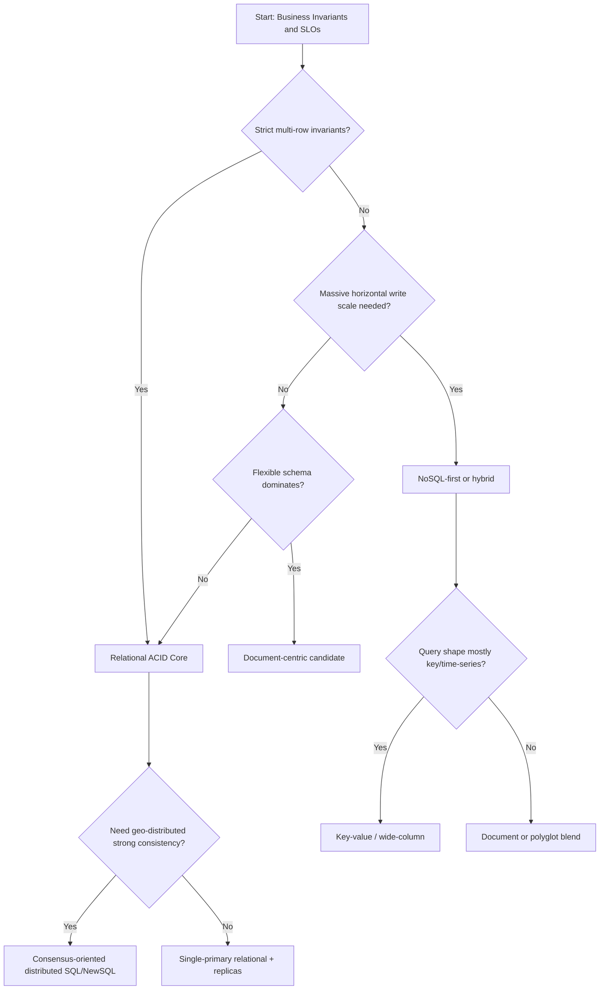
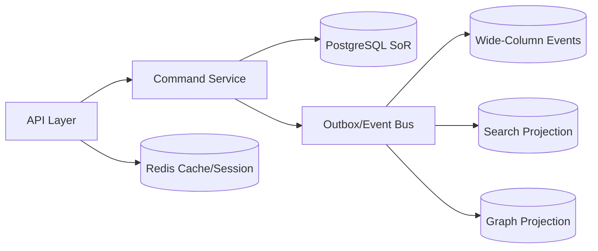

# Database Selection Playbook for Senior Architects

## 1. Objective

Provide a repeatable decision framework to select data systems based on workload physics, consistency semantics, and operational constraints, not vendor preference.

---

## 2. Inputs Required Before Any Selection

Minimum dataset for decision:

1. Read/write ratio and request concurrency envelope.
2. Latency SLOs (P50/P95/P99) by operation class.
3. Consistency contracts per business invariant.
4. Data volume growth curve and retention horizon.
5. Query patterns (point lookup, range scan, aggregations, graph traversal).
6. Failure tolerance targets (RTO/RPO, acceptable stale-read windows).

If these are unknown, perform discovery first; selection at this stage is guesswork.

---

## 3. Decision Flow (Architecture-Level)

---

## 4. Quantitative Evaluation Matrix

Score each candidate (1-5) with weighted criteria:

| Criterion | Weight | Notes |
|---|---:|---|
| Correctness fit (invariants) | 25% | Can model guarantees without excessive app compensation? |
| P99 latency fit | 20% | Includes replication/consensus effects |
| Write scalability ceiling | 15% | Hotspot sensitivity and partitioning model |
| Query flexibility | 10% | Ad-hoc and evolving access patterns |
| Operational complexity | 15% | Team readiness, tooling, on-call load |
| Cost efficiency at scale | 10% | Compute, storage, data transfer, ops labor |
| Migration/reversibility | 5% | Exit cost and interoperability |

Weighted score:

`Total = SUM(criterion_score * criterion_weight)`

Require:

- hard pass on correctness fit threshold before considering total score.

---

## 5. Trade-off Lenses

## 5.1 OLTP vs OLAP

- OLTP needs low-latency point writes, transactional guarantees, and contention control.
- OLAP needs scan efficiency, columnar compression, vectorized execution, and large-window aggregations.

Best practice:

- avoid forcing one engine to do both at scale; use analytical replicas/lakes/warehouses when required.

## 5.2 Consistency-Latency Envelope

- Strong consistency adds coordination cost.
- Eventual consistency lowers synchronous latency but shifts complexity to reconciliation and UX expectations.

## 5.3 Access Pattern Dominance

- If primary pattern is key lookup: key-value/wide-column excels.
- If predicates and joins are central: relational excels.
- If relationship traversal depth is central: graph excels.

## 5.4 Columnar vs Operational Stores

- Columnar engines optimize analytical scans and aggregations with compression and vectorized execution.
- Operational row/document/KV engines optimize request-time transactional or low-latency serving paths.
- Mixing OLTP and OLAP on the same primary engine at scale usually creates contention and unpredictable tail latency.

## 5.5 Key-Value and Graph in Decision Boundaries

- Choose key-value when business value is dominated by key-based retrieval and strict SLA latency.
- Choose graph when business value is dominated by multi-hop relationship reasoning.
- In both cases, define integration boundaries with relational/document systems for invariants and reporting needs.

---

## 6. Polyglot Persistence Blueprint

Reference enterprise pattern:

- **System of Record:** PostgreSQL (ACID command path).
- **Session and throttling:** Redis key-value.
- **High-ingest event storage:** Cassandra/Bigtable-style wide-column.
- **Search and analytics projections:** Elasticsearch/OpenSearch + warehouse.
- **Graph intelligence:** graph DB for fraud/recommendation subdomain.

---

## 7. Case Studies

## Case A: Financial Ledger Platform

Constraints:

- no double-spend, strict audit trail, deterministic replay.

Decision:

- relational ACID core (serializable or carefully controlled repeatable read), append-only journal, immutable event history.

Why:

- compensation cost and regulatory risk exceed latency cost from stronger coordination.

## Case B: Global Product Catalog + Personalization

Constraints:

- high read fan-out, evolving attributes, low-latency regional reads.

Decision:

- document store for flexible product docs, search index for retrieval, relational service for pricing and contracts.

Why:

- schema flexibility and denormalized read performance dominate; strict invariants isolated to specific bounded contexts.

## Case C: IoT Telemetry Ingestion

Constraints:

- massive append throughput, time-window analytics, acceptable eventual consistency for dashboards.

Decision:

- wide-column/time-series storage + downstream OLAP platform.

Why:

- partitioned append model and compaction economics outperform row-transaction engines for this access pattern.

---

## 8. Failure-First Validation Before Production

Run mandatory architecture tests:

1. Partition and failover drills.
2. Hot partition simulation.
3. Replica lag and stale-read tolerance checks.
4. Lock/contention stress and deadlock behavior.
5. Backup restore and point-in-time recovery verification.

#### In-Line Glossary: Blast Radius

**What it is:** The scope of user/business impact caused by a component or shard failure.  
**Why here:** Database topology can localize or amplify failures.  
**Systemic impact:** Ownership-based partitioning and isolation patterns reduce systemic outages.

---

## 9. Final Architect Decision Protocol

A decision is complete only when:

- Trade-offs are documented as an ADR.
- SLO impact is measured, not estimated.
- Failure modes are tested in pre-production.
- Operational runbooks and ownership are explicit.
- Exit strategy (migration path) is known.

This playbook should be reused for every major domain, not executed once and forgotten.
