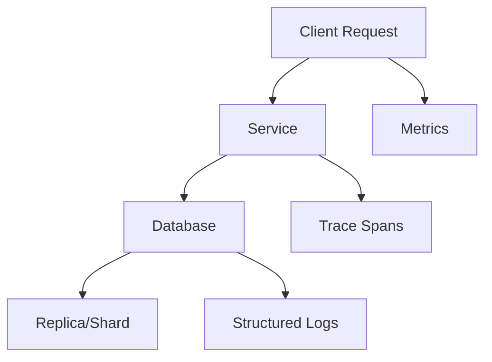
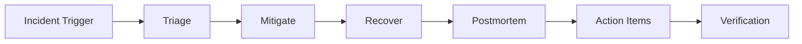

# Operational Excellence for Databases: SRE, Reliability, and Governance

## 1. Objective

Database architecture is incomplete without operational excellence.  
This document defines the reliability, observability, security, and governance baseline required for senior-level practice.

---

## 2. SLO/SLI Framework for Data Platforms

Core SLIs:

- write success rate
- read success rate
- replication lag percentile
- commit latency percentiles
- recovery test success rate

SLO design:

- separate user-facing and internal SLOs
- define error budgets and burn-rate alerting

#### In-Line Glossary: Error Budget

**What it is:** Allowed unreliability window derived from SLO target (for example, 99.9% implies ~43.2 minutes downtime/month).  
**Why here:** Enables explicit trade-offs between feature velocity and reliability risk.  
**Systemic impact:** Budget exhaustion should trigger release restraint and reliability remediation.

---

## 3. Observability Baseline

### 3.1 Metrics

- RED/USE metrics for database endpoints and engine internals.
- Cardinality control for labels to prevent telemetry cost explosion.

### 3.2 Logging

- structured logs with correlation IDs and transaction identifiers.
- explicit error taxonomy (timeout, deadlock, stale read, failover event).

### 3.3 Tracing

- end-to-end spans including queue/broker boundaries.
- annotate retries, circuit-open events, and quorum wait durations.

---

## 4. Backup, Restore, and DR Engineering

Minimum standard:

1. periodic full and incremental backups
2. point-in-time recovery validation
3. cross-region copy with retention policies
4. automated restore drills

RTO/RPO governance:

- map each bounded context to explicit recovery targets.
- validate with game-day scenarios, not only policy documents.

---

## 5. Failure Mode Engineering

### Mandatory Scenarios

- primary loss and failover correctness
- network partition and split-brain prevention
- storage saturation and degraded-mode behavior
- compaction/checkpoint storms
- lock contention spikes and queue collapse

### Resilience Controls

- adaptive timeouts
- bounded retries with jitter
- load shedding and admission control
- workload isolation per tenant/domain

---

## 6. Security and Compliance for Data Architectures

- encryption at rest with managed key rotation
- mTLS in transit for east-west and north-south traffic
- least-privilege role model and short-lived credentials
- immutable audit logs for privileged changes

Compliance mapping:

- retention and deletion controls by data class
- PII minimization and tokenization where possible

---

## 7. Capacity and Cost Governance

Model inputs:

- growth projections (ingest, storage, index expansion)
- workload seasonality and burst envelopes
- per-query and per-tenant cost attribution

Queueing lens:

- as utilization approaches saturation, queue wait dominates total latency
- capacity plans must be based on tail percentile behavior, not average throughput

---

## 8. Runbook and Ownership Standards

Every critical datastore needs:

- clear service owner/on-call rotation
- incident runbooks with decision trees
- rollback/failback scripts and verification steps
- postmortem process with corrective action tracking

---

## 9. External Visual References

- [Google SRE Workbook](https://sre.google/workbook/table-of-contents/)
- [OpenTelemetry Documentation](https://opentelemetry.io/docs/)
- [NIST SP 800-57 Key Management](https://csrc.nist.gov/publications/detail/sp/800-57-part-1/rev-5/final)
