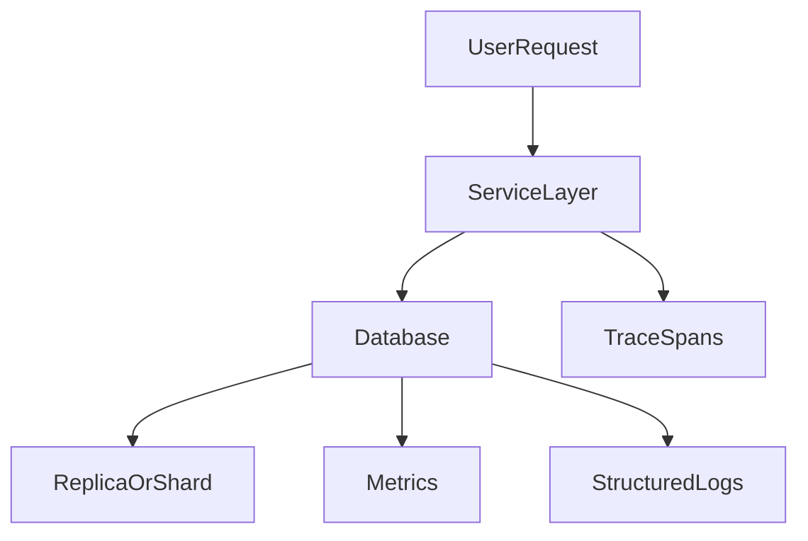
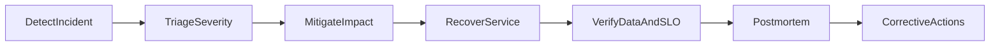

# Operational Excellence for Databases: Reliability Math, Failure Governance, and Production Discipline

## 1. Purpose

Operational excellence is the difference between a database that works in demos and one that survives real production conditions. This document defines the reliability and governance standard expected for senior-level operation.

---

## 2. SLO/SLI Model for Database Platforms

Core SLIs should measure whether the database is meeting user-visible and operational contracts, not merely whether the process is up.

Track successful write rate so you know what fraction of committed write attempts complete without engine or infrastructure error, which directly protects command-path correctness. Track successful read rate for the same reason on read paths, separating timeouts and error classes that users experience from background health checks. Measure commit latency at p95 and p99 so tail behavior—not average latency—drives capacity and release decisions. Monitor replication lag percentiles because lag is the primary signal that stale-read exposure is growing beyond policy. Measure failover completion time against RTO objectives so ownership transfer remains a controlled operation rather than an open-ended outage. Track restore success rate and restore duration so backup confidence is grounded in proven recovery, not backup job green lights alone.

### 2.1 Error Budget Math

For SLO target `S`, allowed error budget over window `T` is:

`budget = (1 - S) * T`

A monthly availability SLO of 99.9% yields roughly 43.2 minutes of allowed unavailability in a 30-day window. That budget is the shared currency between reliability work and feature velocity: consuming it quickly should throttle risky change, while remaining budget can authorize carefully gated releases.

#### In-Line Glossary: Burn Rate

**What it is:** speed at which error budget is consumed relative to target window.  
**Why here:** rapid burn indicates systemic risk and should trigger release throttling.  
**Systemic implication:** burn-rate alerts connect reliability objectives to engineering cadence.

---

## 3. Observability Architecture

### 3.1 Metrics

Track both user-facing and engine-facing signals so incidents are diagnosed from symptoms to root causes without blind spots.

Request rate, errors, and latency form the RED-style user signal set that tells you whether clients are succeeding within budget. Lock wait times expose contention hotspots that inflate p99 commits even when CPU looks idle. Checkpoint and compaction pressure reveal background work that can starve foreground I/O and cause sudden latency cliffs. Replica lag metrics quantify how far secondaries trail the primary and therefore how large the stale-read window has become. Cache hit ratio and IO saturation show whether the working set still fits memory or whether storage bandwidth has become the bottleneck.

### 3.2 Logs

Structured logs should be joinable to metrics and traces so operators can move from a spike to a concrete transaction or session.

Include correlation IDs so a single user request can be followed across service and database layers. Emit transaction and session identifiers so lock holders, long runners, and failed commits can be isolated without guesswork. Apply a stable error class taxonomy so alerts and postmortems group failures by cause (timeout, constraint, deadlock, IO) instead of opaque vendor strings.

### 3.3 Traces

Distributed traces must include DB spans and retry annotations so latency can be attributed to query planning, lock wait, network, or client retry amplification rather than blamed generically on "the database."

---

## 4. Backup and Recovery Engineering

Required controls exist to make RPO and RTO measurable and rehearsable.

Maintain a full plus incremental backup schedule sized to retention policy and change rate so recovery points remain dense enough for declared RPO. Ensure point-in-time recovery capability so operators can restore to a precise safe timestamp after logical corruption or bad deploy, not only to the last full snapshot. Apply cross-region retention where regulatory or disaster scenarios require surviving regional loss. Run periodic restore drills that actually rebuild and validate data, because restore latency and correctness only appear under test.

Recovery confidence is proven only by restoration tests, never by backup existence alone.

---

## 5. Failure Mode Catalog and Response

Mandatory scenario classes cover the failures that routinely turn into prolonged outages if they are not pre-scripted.

Primary node crash must be detectable and fail over within RTO without silent data loss or split ownership. Network partition and split-brain risk must be handled with fencing and quorum rules so two primaries cannot accept conflicting writes. Storage saturation must trigger early alerts and containment before the engine becomes unable to checkpoint, compact, or accept writes. Replication backlog or lag explosion must be treated as a consistency and capacity incident, not a cosmetic metric drift. Lock or queue collapse under hotspot traffic must have shedding and isolation paths so one hot key cannot exhaust the platform.

For each scenario define a detection signal that fires before users declare an outage, an initial containment action that stops blast-radius growth, explicit failover or fallback criteria that remove human ambiguity under pressure, and recovery validation steps that prove data integrity and SLO restoration before declaring green.

---

## 6. Resilience Controls

Resilience controls sit in clients and platforms to keep partial failure from cascading into total loss of correctness or availability.

Use adaptive timeouts so callers fail fast when the database cannot answer within budget instead of holding threads indefinitely. Retry with backoff and jitter so transient errors recover without synchronized retry storms that amplify load. Apply circuit-breaker behavior for dependent services so a degraded database path trips open and protects upstream capacity. Implement load shedding and admission control so overload rejects low-priority work while preserving critical correctness paths. Isolate tenants or workloads so noisy neighbors and hot partitions cannot consume shared pools that protect unrelated traffic.

These controls reduce blast radius and preserve core correctness paths.

#### In-Line Glossary: Blast Radius

**What it is:** maximum scope of impact from a single failure event.  
**Why here:** architecture quality is measured by how small and recoverable failures are.  
**Systemic implication:** partitioning and isolation boundaries should be intentionally designed to cap impact.

---

## 7. Capacity and Cost Discipline

Capacity planning inputs must anticipate growth and failure overhead, not only today's steady-state averages.

Project throughput growth so connection pools, CPU, and commit paths are sized before saturation. Profile storage and index growth because indexes and MVCC/versioning overhead often outpace raw row growth and drive IO cost. Define the burst concurrency envelope so peak events do not surprise the platform into queue collapse. Include failover overhead margin because surviving nodes must absorb redirected load without immediately violating latency SLOs.

Queueing reminder: as utilization approaches saturation, wait time grows nonlinearly, so "a little headroom left on average CPU" is not a safe operating posture.

Operational rule: capacity targets must be based on tail percentiles, not average utilization.

---

## 8. Security and Compliance Baseline

Security controls must be operationally testable, not document-only intentions.

Encrypt data at rest with a documented key-rotation policy so compromised media or keys have a bounded exposure window. Protect traffic with TLS or mTLS so credentials and row data are not exposed on the wire between clients, proxies, and nodes. Enforce a least-privilege access model so applications and humans receive only the statements and objects they need. Keep auditable logs of privileged operations so break-glass and DBA actions are reconstructable during investigations. Apply retention and deletion controls by data classification so regulatory delete and hold requirements can be demonstrated in practice.

---

## 9. Incident Governance Lifecycle

Postmortem quality requirements turn incidents into durable reliability improvements rather than narrative postmortems without change.

Produce a causal timeline that sequences detection, decisions, and recovery actions with evidence. Identify contributing factors across people, process, and technology so root cause is not reduced to a single scapegoat component. Define prevention actions with named owners and due dates so corrective work enters the engineering backlog with accountability.

---

## 10. Production Readiness Checklist

Before production go-live, confirm that reliability contracts and operational muscle exist in the target environment—not only in design docs.

1. SLO, SLI, and error budget definitions are approved by product and platform owners so availability and latency expectations are shared and enforceable.
2. Dashboards and alerts are validated against synthetic or historical failure signals so pages fire on the right conditions with actionable context.
3. Failover and restore drills have passed with measured RTO/RPO evidence, proving recovery paths work under realistic conditions.
4. Runbooks have been tested by the on-call team so mitigation steps are executable without tribal knowledge during an incident.
5. Security controls are verified in the environment, including encryption, access policy, and audit logging, rather than assumed from staging parity.

Only after this checklist can a database platform be considered operationally ready.

---

## 11. External References

- [Google SRE Workbook](https://sre.google/workbook/table-of-contents/)
- [OpenTelemetry Docs](https://opentelemetry.io/docs/)
