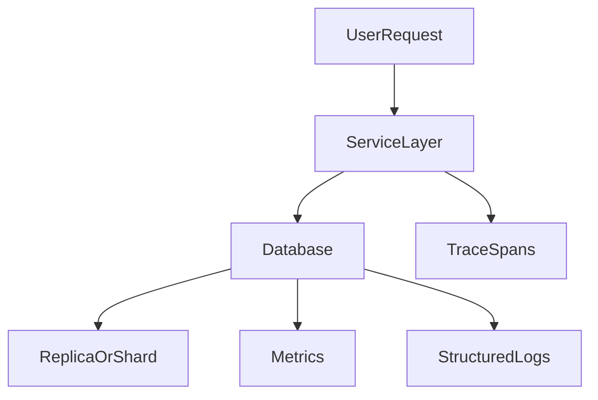
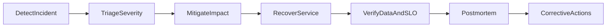

# Operational Excellence for Databases: Reliability Math, Failure Governance, and Production Discipline

## 1. Purpose

Operational excellence is the difference between a database that works in demos and one that survives real production conditions. This document defines the reliability and governance standard expected for senior-level operation.

---

## 2. SLO/SLI Model for Database Platforms

Core SLIs should include:

- successful write rate
- successful read rate
- commit latency p95/p99
- replication lag percentiles
- failover completion time
- restore success and restore duration

### 2.1 Error Budget Math

For SLO target `S`, allowed error budget over window `T` is:

`budget = (1 - S) * T`

Example:

- monthly availability SLO 99.9% -> ~43.2 minutes budget

#### In-Line Glossary: Burn Rate

**What it is:** speed at which error budget is consumed relative to target window.  
**Why here:** rapid burn indicates systemic risk and should trigger release throttling.  
**Systemic implication:** burn-rate alerts connect reliability objectives to engineering cadence.

---

## 3. Observability Architecture

### 3.1 Metrics

Track both user-facing and engine-facing signals:

- request rate, errors, latency
- lock wait times
- checkpoint/compaction pressure
- replica lag
- cache hit and IO saturation

### 3.2 Logs

Structured logs should include:

- correlation IDs
- transaction/session identifiers
- error class taxonomy

### 3.3 Traces

Distributed traces must include DB spans and retry annotations.

---

## 4. Backup and Recovery Engineering

Required controls:

1. full + incremental backup schedule
2. point-in-time recovery capability
3. cross-region retention where required
4. periodic restore drills

Recovery confidence is proven only by restoration tests, never by backup existence alone.

---

## 5. Failure Mode Catalog and Response

Mandatory scenario classes:

- primary node crash
- partition and split-brain risk
- storage saturation
- replication backlog/lag explosion
- lock or queue collapse under hotspot traffic

For each scenario define:

- detection signal
- initial containment action
- failover/fallback criteria
- recovery validation steps

---

## 6. Resilience Controls

- adaptive timeouts
- retry with backoff and jitter
- circuit-break behavior for dependent services
- load shedding/admission control
- tenant or workload isolation

These controls reduce blast radius and preserve core correctness paths.

#### In-Line Glossary: Blast Radius

**What it is:** maximum scope of impact from a single failure event.  
**Why here:** architecture quality is measured by how small and recoverable failures are.  
**Systemic implication:** partitioning and isolation boundaries should be intentionally designed to cap impact.

---

## 7. Capacity and Cost Discipline

Capacity planning inputs:

- throughput growth projection
- storage/index growth profile
- burst concurrency envelope
- failover overhead margin

Queueing reminder:

- as utilization approaches saturation, wait time grows nonlinearly

Operational rule:

- capacity targets must be based on tail percentiles, not average utilization.

---

## 8. Security and Compliance Baseline

- encryption at rest with key-rotation policy
- TLS/mTLS for traffic protection
- least-privilege access model
- auditable privileged operation logs
- retention/deletion control by data classification

Security controls must be operationally testable, not document-only intentions.

---

## 9. Incident Governance Lifecycle

Postmortem quality requirements:

- causal timeline
- contributing factors
- prevention actions with owners and due dates

---

## 10. Production Readiness Checklist

Before production go-live:

1. SLO/SLI/error budget definitions approved
2. dashboards and alerts validated
3. failover and restore drills passed
4. runbooks tested by on-call team
5. security controls verified in environment

Only after this checklist can a database platform be considered operationally ready.

---

## 11. External References

- [Google SRE Workbook](https://sre.google/workbook/table-of-contents/)
- [OpenTelemetry Docs](https://opentelemetry.io/docs/)
